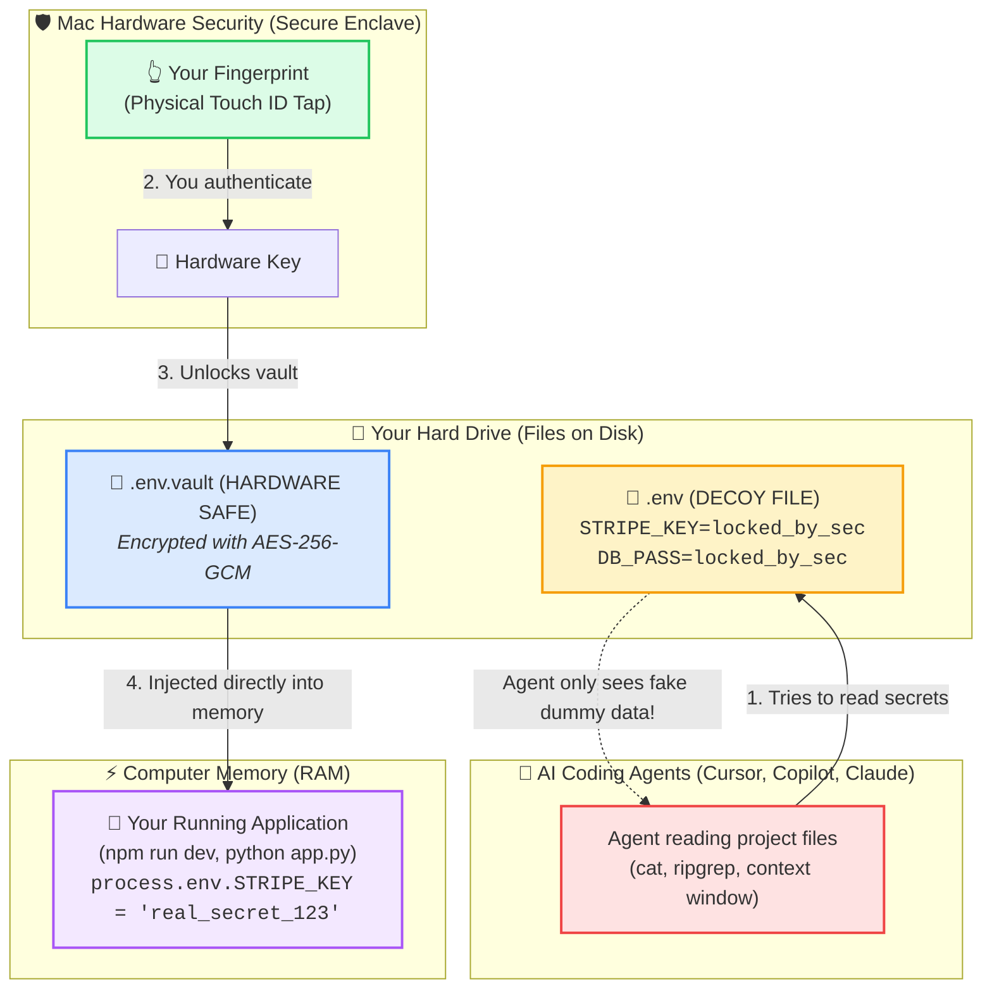

# Secret Manager (`sec`): Touch ID Secret Vault for macOS

> **Shield your `.env` and secret files from AI agents & background tools.**  
> Keep secrets encrypted on disk with Touch ID, inject them directly into process memory during development, and lock/edit files via macOS Finder right-click.

---

## ⚡ The Threat Model

AI coding agents (Cursor, Claude Desktop, Antigravity, GitHub Copilot, local LLMs) inspect your project workspace, run shell tools (`cat`, `ripgrep`, `grep`), and ingest files into context windows.

If your `.env` contains live credentials (database connection strings, Stripe keys, OpenAI tokens), any agent tool call can read and log them.

**Why traditional approaches fail:**
If a utility decrypts `.env` to plaintext on disk while your dev server runs (`npm run dev`), the agent can read those secrets at any moment during development.

**How `sec` solves this:**
1. **Plaintext never touches the disk during development**: Real secrets are encrypted in `.env.vault` (AES-256-GCM with hardware-backed macOS Keychain key).
2. **Sanitized Placeholder**: The `.env` file on disk is replaced with masked dummy values (e.g. `API_KEY=locked_by_sec`) so project linters, syntax highlighters, and static tools never break.
3. **In-Memory Injection**: When you run `sec npm run dev`, Touch ID prompts once, decrypts secrets directly into RAM (`process.env`), and passes them to the child process. AI agents reading the filesystem only ever see dummy placeholders.
4. **Strict Zero-Cache (Single-Use)**: Every command execution requires a physical Touch ID tap. Decrypted secrets live exclusively in the child process memory and are destroyed when the command exits. No session tokens linger on disk for AI agents to piggyback on.
5. **Stealth In-Memory Loaders (Defeats `ps -E` Process Inspection)**: For Node.js/Python development (`npm run dev`, `pnpm`, `bun`, `yarn`, `python`), secrets are injected via ephemeral, self-destructing preload hooks rather than passing plaintext through `execve` `envp`. AI agents running `ps -E` or querying Darwin's `KERN_PROCARGS2` see zero secrets.
6. **Finder Right-Click Quick Actions**: Right-click any secret file in Finder to lock or edit it with Touch ID.

## 💡 How It Works (In Plain English)

Imagine you have a wallet full of cash sitting on your office desk. If someone walks into your room to help you with your work (like an AI assistant), they can easily see and copy everything inside your wallet.

**`sec` works like a high-tech biometric safe with a decoy wallet:**

1. **The Decoy File**: `sec` replaces your real `.env` file on your desk with a fake "decoy" file where all sensitive passwords look like `API_KEY=locked_by_sec`. If an AI agent looks around your folders, it only sees the fake decoy data.
2. **The Hardware Biometric Safe**: Your real secrets are encrypted inside a digital safe (`.env.vault`) that can only be opened with your fingerprint (Touch ID) and Apple Silicon's hardware chip.
3. **The Invisible Hand-off**: When you start your app (`sec npm run dev`), you tap Touch ID. `sec` briefly opens the safe, hands the real keys directly into your app's memory (RAM) behind closed doors, and immediately locks the safe. **The real passwords never touch your hard drive in plaintext.**

### 🗺️ Visual Architecture Diagram



### ⚖️ Before vs. After `sec`

| Situation | Without `sec` ❌ | With `sec` ✅ |
|---|---|---|
| **What lives on your hard drive** | Plaintext credentials (`API_KEY=sk_live_12345`) | Masked decoy (`API_KEY=locked_by_sec`) + encrypted `.vault` |
| **What AI agents can read** | Live passwords, database links, and secret tokens | Only the decoy labels (`locked_by_sec`) |
| **What your dev server gets** | Reads plaintext file from disk | Receives real secrets directly into RAM on Touch ID tap |
| **If someone steals your project folder** | All secrets are completely exposed | Secrets are uncrackable AES-256-GCM without your biometric fingerprint |

---

## 🚀 Installation

### Option 1: Homebrew Cask (Recommended)
Install the **Secret Manager** desktop GUI app and the `sec` CLI with a single command:
```bash
brew tap rajanchavda/tap
brew install --cask secret-manager
```
To update at any time:
```bash
brew upgrade secret-manager
```

### Option 2: Download DMG Installer (Universal for Apple Silicon & Intel)
1. Download the latest `Secret-Manager-X.Y.Z.dmg` from [GitHub Releases](https://github.com/rajanchavda/file-sec/releases).
2. Open the `.dmg` and drag **Secret Manager** into `/Applications`.
3. *Note for direct downloads*: Since this open-source project does not use a paid Apple Developer certificate, on first launch right-click the app in `/Applications` and select **Open** (or run `xattr -cr "/Applications/Secret Manager.app"`). *Using Homebrew bypasses this step automatically.*

### Option 3: Build & Install From Source
From this repository directory:
```bash
./install.sh
# or: make install
```

---

## 🖱️ Finder Right-Click Usage

Once installed:
- **Lock a file**: Right-click `.env` (or any secret file) in macOS Finder ➡️ **Quick Actions / Services** ➡️ **Lock Secrets with Touch ID (sec)**.
- **Unlock a file**: Right-click `.env.vault` (or an already locked file) ➡️ **Quick Actions / Services** ➡️ **Unlock Secrets with Touch ID (sec)**.  
  *(Note: If you ever click "Lock" on an already locked file, `sec` automatically detects it and displays the **Unlock Secrets** option immediately instead of re-locking).*
- **View secrets**: Right-click `.env.vault` (or `.env`) in Finder ➡️ **Quick Actions / Services** ➡️ **View Secrets with Touch ID (sec)**. Prompts Touch ID and prints formatted secrets in Terminal without leaving plaintext on disk.
- **Edit a vault**: Right-click `.env.vault` in Finder ➡️ **Quick Actions / Services** ➡️ **Edit Secrets with Touch ID (sec)**.

A native macOS notification banner will confirm when your file is protected or restored.

---

## 💻 CLI Usage

### 1. Lock a Secret File
```bash
sec lock .env
```
* Encrypts `.env` into `.env.vault`.
* Generates a dummy `.env` on disk:
  ```env
  # 🔒 PROTECTED BY sec (Touch ID Secret Vault)
  # Real secrets are encrypted in .env.vault
  # Run commands: sec npm run dev   |   Edit secrets: sec edit
  
  DATABASE_URL=locked_by_sec
  STRIPE_SECRET_KEY=locked_by_sec
  PORT=3000
  ```
* Automatically adds `.env.vault` to `.gitignore`.
* **Idempotent & Safe**: If `.env` is already locked (or if you right-click and lock it again in Finder), `sec` detects it immediately without prompting Touch ID, refuses to overwrite your vault with dummy placeholders, and displays a friendly notification.
* To force re-lock with current file contents, use `sec lock --force .env`.

---

### 2. Run Commands with Secrets Injected (In-Memory)
Simply prefix any command with `sec`:
```bash
sec npm run dev
sec pnpm dev
sec cargo run
sec python app.py
sec docker compose up
```
* Prompts Touch ID once.
* Real secrets are injected into process memory (`process.env`).
* Output and interactive terminal TTY features (colors, curses, Ctrl+C signals) work seamlessly.
* Monorepo friendly: automatically searches parent directories if running inside a nested subpackage!

---

### 3. Safely Edit Secrets
```bash
sec edit .env
```
* Prompts Touch ID.
* Decrypts secrets into an ephemeral, secure temporary buffer (`0600` permissions).
* Opens your `$EDITOR` (VS Code `--wait`, Cursor `--wait`, Nano, or Vim).
* On save and close: automatically re-encrypts `.env.vault`, refreshes the placeholder `.env`, and securely shreds the temporary file.

---

### 4. View Secrets in Terminal
```bash
sec view .env
```
* Prompts Touch ID and outputs decrypted key-value pairs to terminal stdout.

---

### 5. Check Vault & Session Status
```bash
sec status
```
Outputs:
```text
=== sec Status ===
🔑 Keychain Master Key: ✅ Configured (Secure Enclave / Keychain)
🛡️  Access Policy:       🔒 Strict Zero-Cache (Single-Use)
                       (Every command requires Touch ID; no lingering cache for AI agents)
📁 Current Vault:       Found '.env.vault' at /Users/you/project
```

Inspect access policy:
```bash
sec session
```

---

### 6. List & Audit Protected Vaults Across Your Mac
```bash
sec list
```
Outputs an aggregated overview of all locked vaults across your folders:
```text
=== 🔒 Protected Vaults Across Your Mac ===

📁 ~/Developer/my-saas-app
   • Target:    .env
   • Vault:     .env.vault (348 bytes)
   • Status:    🔒 Protected (Decoy active on disk)
   • Modified:  Sep 25, 2026, 10:48 PM

📁 ~/Projects/backend-api
   • Target:    config.json
   • Vault:     config.json.vault (512 bytes)
   • Status:    🔒 Protected (Decoy active on disk)
   • Modified:  Sep 24, 2026, 04:15 PM
```

* **Discover unindexed vaults**:
  ```bash
  sec list --scan             # Scans user home directory (skips caches & node_modules)
  sec list --scan ~/Developer # Scans a specific folder tree
  ```
* **Clean up deleted/missing vaults**:
  ```bash
  sec list --prune
  ```
* **Scripting / JSON output**:
  ```bash
  sec list --json
  ```

---

### 7. Permanently Unlock (Restore Plaintext to Disk)
```bash
sec unlock .env
```
* Prompts Touch ID, restores plaintext `.env` on disk, and removes `.env.vault`.

---

## 🏗️ Architecture & Security

- **Cryptography**: AES-256-GCM via Apple's native `CryptoKit`.
- **Key Storage**: Hardware-backed master key generated and stored inside the Apple Silicon Secure Enclave (`CryptoKit.SecureEnclave.P256.KeyAgreement` + HKDF), eliminating `login.keychain` password popups.
- **Biometrics**: Apple `LocalAuthentication` (`LAPolicy.deviceOwnerAuthenticationWithBiometrics`) with automatic fallback to Mac login password if the MacBook lid is closed or docked.
- **Zero Third-Party Dependencies**: Pure native Swift utilizing Apple system frameworks (`CryptoKit`, `Security`, `LocalAuthentication`, `Foundation`).
- **Memory Safety**: No plaintext ever written to disk during `sec run`. Temporary edit buffers are shredded with random bytes before deletion.

---

## 🧪 Running Tests

```bash
make test
```
Runs the XCTest suite validating encryption round-trips, `.env` parsing, and vault URL resolution.

## 🔄 In-App Updates
Secret Manager includes a native, zero-dependency update checker:
- **Menu Bar**: Click **Secret Manager** in the top macOS menu bar ➡️ **Check for Updates...**
- **Settings**: Click the gear icon in the app header ➡️ **Check for Updates...**
- When a new version is published on GitHub, a native update dialog provides release notes, a direct DMG download link, and a copy button for `brew upgrade secret-manager`.

---

## 📦 Automated Release Pipeline (No Apple ID Required)

Releases are fully automated via GitHub Actions on Git tag push:

```bash
git tag v1.0.1
git push origin v1.0.1
```

The GitHub Actions workflow automatically:
1. Compiles a native **Universal 2** binary supporting both Apple Silicon (M1/M2/M3/M4) and Intel Macs.
2. Ad-hoc signs the application bundle.
3. Packages a compressed DMG (`Secret-Manager-1.0.1.dmg`) with `/Applications` drag-and-drop installer.
4. Generates SHA256 checksums (`Secret-Manager-1.0.1.dmg.sha256` and `SHA256SUMS.txt`).
5. Publishes a GitHub Release with release notes and attaches all release assets.
6. Outputs the updated Homebrew Cask formula for your tap repository.

See [docs/HOMEBREW_GUIDE.md](docs/HOMEBREW_GUIDE.md) for full Homebrew Tap hosting setup.

---

## 📄 License
MIT License.
